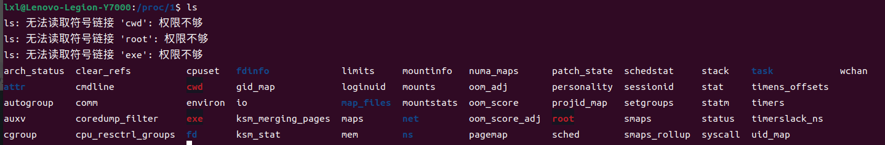

# proc简介

## 1.proc是一种特殊文件系统
proc文件系统是接入vfs的，也就是说可以当成一般文件进行访问，但是不存在磁盘系统中,使用 __ls -l__ 进行查看，可以看到是大小为0的，读取的时候，通过内存中的信息，进行读取。

它的主要作用是给用户提供内核的运行状态信息，方便用户了解资源使用，内存使用等信息。

## 2.proc文件组成

### 2.1内核信息

+ /proc/cpuinfo     cpu的信息
+ /proc/meminfo     物理内存、交换空间等消息
+ /proc/loaddavg    查看系统1分钟、5分钟、15分钟的平均负载情况
+ /proc/mounts      已经加载的文件系统列表
+ /proc/devices     可用的设备列表
+ /proc/filesystems 被支持的文件系统
+ /proc/modules     已经加载的内核模块
+ /proc/version     内核版本
+ /proc/cmdline     系统启动时输入的内核命令行参数
+ ......

### 2.2进程相关信息

文件名就是进程的pid,其是一个目录，里面会有进程的状态和环境的重要细节信息。

### 2.3 通过proc与内核交互

上述的文件大部分都是可读文件，但是/proc是可以通过读写文件与内核进行交互的，将想要的更改写入文件中，内核获取之后会修改

+ /proc/sys                                 存放所有可以读写的文件的目录，可以被修改来改变内核行为
+ /proc/sys/kernel                          包含通用的内核行为的信息
+ /proc/sys/kernel/{domainname, hostname}   存放着机器/网络的域名和主机名